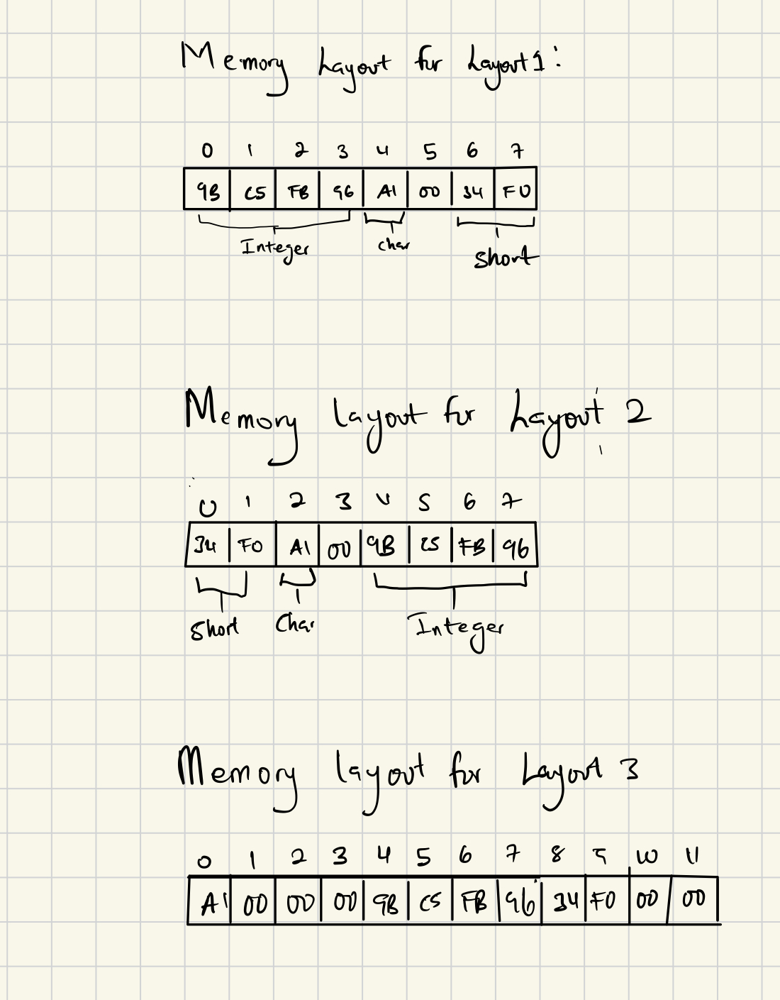

# CS333 - Project # - README
### Rose Frimpomaa Agyapong
### 02/20/2025

***Google Sites Report: https://sites.google.com/colby.edu/rosefrimpomaa/home ***

## Directory Layout:
```
proj01/
|
|__/C/
|  |
|  |__/task1.c
|  |__/task2.c
|  |__/task3.c
|  |__/task4.c
|  |__/task5.c
|__/JS/
|  |
|  |__/task1.js
|  |__/task2.js
|__/MySQL/
|  |
|__|__/task1.sql
|__|__/task2.sql
|__/images/
|  |
|__|__|ctask1.png
|__|__|ctask2.png
|__|__|ctask3.png
|__|__|ctask4.png
|__|__|ctask5.png
```
## OS and C compiler
OS: OSX Ventura 13.6.7 
C compiler: Apple clang version 15.0.0 (clang-1500.0.40.1)

## Part I 
### task 1
**Compile:** $ gcc -o myexec program1.c

**Run:** $ ./myexec

**Output:**

**Q.b.** 
I am using little-endian machine

**Q.c.** 
That is because the outputs start from the least significant byte(right) to more significant(left) byte


 
###task 2
**Compile:** $ gcc -o myexec program2.c

**Run:** $ ./myexec

**Output:**
      

**Q.b.** 
The overall layout of the stack is such that the char is at the bottom (since it was stored first) followed by short int, int, long int and ptr in that order. So it works in such a way that the value in the particular memory will be accessed starting from the ptr then to the long int and all the way to the char. It will now start accessing different memory once we are through to char and we have still not obtained 100


**Q. c.**
Yes, I find some non-zero values that do not make sense.

**Q. d.**
I can see all the variables I declared. I realised when the program finished accessing the ptr, it moved to the long int(the last two digits) and then continued through int, short int to char.

###task 3
**Compile:** $ gcc -o myexec program3.c

**Run:** $ ./myexec

**Output:**
<!--  -->


**Q. b**
It uses less memory with the free statement under constant time and then more memory without the free statement with a significant amount of time. 


###task 4
**Compile:** $ gcc -o myexec program4.c

**Run:** $ ./myexec

**Output:**



**Q. a**
No. I used int, short and char. I do not get the same size when I add them "(4 + 2 + 1)bytes" manually. My output is quite different especially for memory layout3 output.

**Q. b**
Yes there are gaps in the way the fields of the structure are laid out. This is beacuse "struct" has two rules. One of them is struct members are stored in memory in the exact order they are declared within the struct definition. The first declared member occupies the lowest memory address, followed by subsequent members in their declaration sequence. That's why my first memory layout is in that order. The last one is that, each member of a struct must be stored at a memory address that is a multiple of its size. This alignment requirement ensures efficient data access by the CPU. To satisfy alignment constraints, the compiler may insert padding bytes between struct members, resulting in a struct size that might be larger than the sum of its members' sizes.
For my memory layout3 output, the integer started from 4 and that is because interger has 4bytes so it will start filling in only multiples of 4. More zeros were added at the end of the integer because it must aslo end in multiple of 4 so hence the zeros.


###task 5
**Compile:** $ gcc -o myexec program5.c

**Run:** $ ./myexec

**Output:**

**Q. a**
The string I found that doesn't work is my full name, Rose Frimpomaa Agyapong(too long!) Vs code aborted it. 


**Q. b**
This is situation stemmed from the input string's length surpassing the maximum size allotted for the ‘name' variable, leading to a spillage of its bytes into the memory space reserved for the ‘balance' variable so vs code aborted it


**Q. c**
This occurrence stemmed from the input string's length surpassing the maximum size allotted for the ‘name' variable, leading to
a spillage of its bytes into the memory space reserved for the ‘balance' variable


*Please note that you don't need Part II for Project 1 as it doesn't require you to write any programs. However, you are expected to include Part II for future projects to illustrate how to compile and run your selected language programs and the outputs you get from them.*

## Part II - JS 
###task 1 (JavaScipt)
**Compile:** JavaScript engines employ Just-In-Time (JIT) compilation for performance optimization. This means that while the code isn't compiled to machine code ahead of time, it is compiled into bytecode or machine code during runtime, just before execution.

**Output:** Output will depend on what kind of data

###task 2 (Go)
**Compile:** go install cmd/compile

**Output:** Output will depend on what kind of data

###task 3 (Rust)
**Compile:** The entire compiler is a library and rustc is just a small crate that calls into the compiler. 

**Output:**Output will depend on what kind of data you are compiling

###task 4 (Swift)
**Compile:** eg. swift index.swift src/delegate.swift src/controller.swift

**Output:**Output will depend on what kind of data you are compiling


*Please have a description of each extension you undertook*

## Extensions
###extension 1
**Description**
My extension1 shows some kinds of runtime-errors in C. I checked for various errors that can be found in a C
program. These include: Array Out of Bounds Error, Zero Division Error, and Integer
Overflow Error

**Compile:** gcc -o myexec extension1.c

**Run:** ./myexec

**Output:**


###extension 2
**Description** For this extension, I made an Improvement on program5 by checking for valid input name, and also, it initializes the account to zero. The program initializes a bank account with a user-provided name and zero balance. It then inspects the memory contents of the name field. Improvement on program5 because of checking for valid input name.
  
**Compile:**gcc -o myexec extension2.c  

**Run:** ./myexec

**Output:**


###extension 3
**Description** For this extension, I wrote the shortest C program you can to generate a
bus error and described the differences between a bus error and a segmentation fault

**Compile:**gcc -o myexec extension3.c 

**Run:** ./myexec

**Output:**
