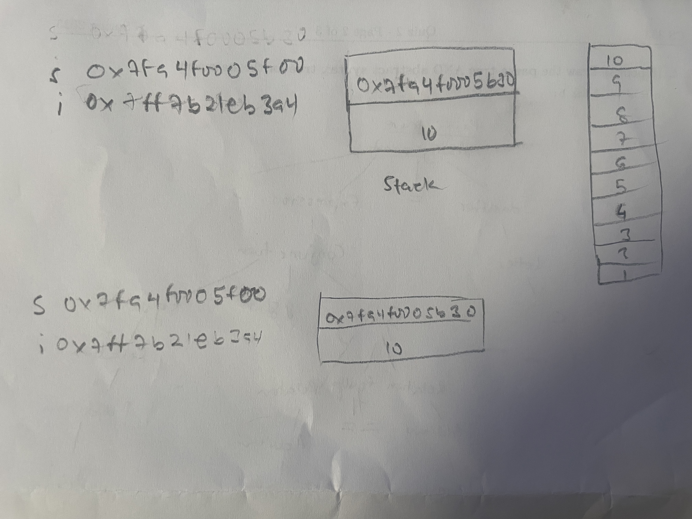
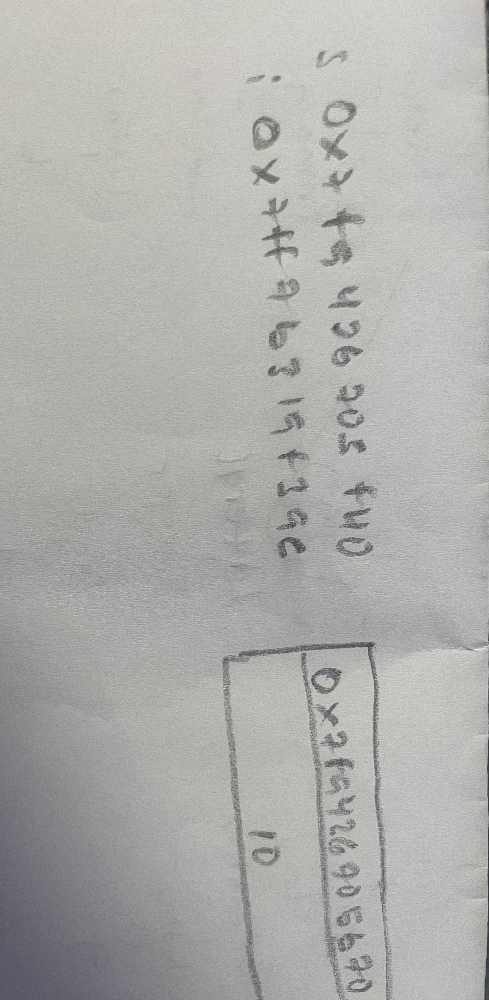

# CS333 - Project 3 - README
### Rose Frimpomaa Agyapong
### 

***Google Sites Report: https://sites.google.com/colby.edu/rosefrimpomaa/home***

## Directory Layout:
```
Project3_rfagya27/
|__
|  |
|  ├── cstk.c
|  ├── cstk.h
|  ├── cstk2.c
|  ├── cstk2.h
|  ├── cstktest.c
|  ├── cstktest2.c
|  ├── task1.cs
|  ├── task2.cs
|  ├── task3.cs
|  ├── task4.cs
|  ├── task5.cs
|  ├── toDraw.c
|  ├── toDraw2.c

|__/extensions/
|  |
|  ├── cstkextension.c
|  ├── cstkextension.h
|  ├── cstkextensiontest.c
|  ├── extension1.cs
|  ├── extension2.cs
|  ├── extension3.cs
|  ├── extension4.cs
|  ├── extension5.cs

|__/images/
|  |
|  ├── 
|  ├── 
|  ├── 
|  ├── 
|  ├── 
|  ├── 
|  ├── 
|  ├── 
|  ├── 
|  ├── 
|  ├── 
|  ├── 
|  ├── 
|  ├── 
|  ├──

|__/recording/
|  |
|  ├── IMG_4040.mov

├── README.md
```

## OS and C compiler
OS: macOS Sequoia version 15.0.1
C compiler: Apple clang version 16.0.0 (clang-1600.0.26.3)


<!-- include how to compile your program, 
how to run your program, 
the program output (a screenshot).  -->

## Part I : C Syntax

### Task 1
**Task:** Created a cstk.h file. The .h file should contain the necessary structures and the declarations of the basic functions of a stack.


### Task 2
**Task:**  Created a cstk.c file. This file contains the implementation of the basic functions declared in the cstk.h file.

 
### Task 3
**Compile:** gcc -o cstktest cstktest.c cstk.c
**Run:** ./cstktest
**Output:** 

### Task 4
<!-- NB: Run this after uncommenting code in the test file -->
**Compile:** gcc -o cstktest cstktest.c cstk.c
**Run:** ./cstktest
**Output:** video included in the folder


### Task 5
**Compile:** gcc -o toDraw toDraw.c cstk.c
**Run:** ./toDraw
**Output 1 - After compilation:** !
**Output 2 - Drawing:** 


### Task 6
**Compile:** gcc -o toDraw2 toDraw2.c cstk2.c
**Run:** ./toDraw2
**Output 1 - After compilation:** !
**Output 2 - Drawing:** 


## Part II - Syntax of C#
 
### Task 1
**Compile:** csc task1.cs
**Run:** mono task1.exe
**Output:** 

 
### Task 2
**Compile:** csc task2.cs
**Run:** mono task2.exe
**Output:** 

 
### Task 3
**Compile:** csc task3.cs
**Run:** mono task3.exe
**Output:** 

 
### Task 4
**Compile:** csc task4.cs
**Run:** mono task4.exe
**Output:**  

 
### Task 5
**Compile:** csc task5.cs
**Run:** mono task5.exe
**Output:** 


## Extensions

### Extension 1
**Description** Example of built-in binary search in C#, and how it's used (Suggested Extension #4)
**Compile:** csc extension1.cs
**Run:** mono extension1.exe
**Output:** 


### Extension 2
**Description** Implemented the get and set in C# in order to add logic to property access. Additionally, auto-implemented properties to simplify declaration of properties(Suggested Extension #2)
**Compile:** csc extension2.cs
**Run:** mono extension2.exe
**Output:** 

### Extension 3
**Description** Made a compileble and runnable Haiku in C# (Suggested Extension #6)
**Compile:** csc extension3.cs
**Run:** mono extension3.exe
**Output:** 


### Extension 4
**Description** Demonstated whether functions are of basic type in C# (Suggested Extension #7)
**Compile:** csc extension4.cs
**Run:** mono extension4.exe
**Output:** 


### Extension 5
**Description** Determined varibale lifetime in C# (Suggested Extension #8)
**Compile:** csc extension5.cs
**Run:** mono extension5.exe
**Output:** 


### Extension 6
**Description** Made the stack more robust so that it can handle overflow errors, or expand automatically as needed (Suggested Extension #9)
**Compile:** gcc -o cstkextension cstkextension.c cstkextensiontest.c 
**Run:** ./cstkextension
**Output:** 


**PS: I Worked alone on these projects**